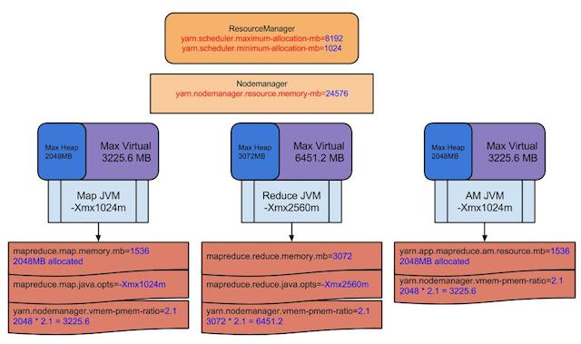

# Yarn下MapReduce部分参数理解

### 0. 写在前面

部分原文来自 [support.pivotal.io](https://support.pivotal.io/hc/en-us/articles/201462036-Mapreduce-YARN-Memory-Parameters) 的翻译，对于该篇文章中感觉概念模糊不清的地方我做了修正，并扩充了我自己的部分理解，有不正确的地方还望大家指正

### 1. Container是什么

Yarn Container就是一个yarn的java进程（这里容易被误解成类似Linux Container的概念），在Mapreduce中的AM，MapTask，ReduceTask， spark的driver和executor等等都作为Container在Yarn的框架上执行，你可以在RM的网页上看到Container的状态。

### 2. 相关参数

1. Yarn

	1. yarn.scheduler.minimum-allocation-mb  最小容器内存，默认1024M
	2. yarn.scheduler.maximum-allocation-mb  最大容器内存，默认8192M
	3. yarn.nodemanager.vmem-pmem-ratio    物理内存与虚拟内存比值，默认2.1，即为使用1G物理内存可以使用2.1G虚拟内存，生产环境中一般会调整大一些，具体虚拟内存分配由操作系统执行，在此不再赘述
	4. yarn.nodemanager.resource.memory-mb   可以分配给container的物理内存数量，默认8192M
	5. yarn.scheduler.increment-allocation-mb  container内存增量，默认1024M

2. MapReduce

	1. mapreduce.{map|reduce}.java.opts
	2. mapreduce.{map|reduce}.memory.mb


### 3. 基础

1. Yarn的ResourceManger（简称RM）通过逻辑上的队列分配内存，CPU等资源给application，默认情况下RM允许最大AM申请Container资源为8192MB(“*yarn.scheduler.maximum-allocation-mb*“)，默认情况下的最小分配资源为1024M(“*yarn.scheduler.minimum-allocation-mb**“)，如果参数中需要的资源在此范围之外，在任务submit的时候会被直接拒绝掉（有兴趣可以翻阅源码）。

2. AM只能以增量  ("*yarn.scheduler.minimum-allocation-mb*") + ("*yarn.scheduler.increment-allocation-mb*")   规整每个task需要的内存，并且申请的内存只能在（”*yarn.scheduler.minimum-allocation-mb*“）和(“*yarn.scheduler.maximum-allocation-mb*“) 的范围内向RM申请资源。用mr任务举例，再默认情况下，比如只修改了map task配置需要1536M内存，但实际分配出来map task占用2G内存，原因在于 **container最小内存1024M < 1560M < container 最小内存为1024M + container内存增量1024M**， 故分配2G内存。（具体检查代码在最后详细解释）

3. 具体mapreduce task内存配置参数见上，不再赘述。
	
### 4. 图例




从上面的图可以看出map，reduce，AM container的JVM，“JVM”矩形代表服务进程，“Max heap”，“Max virtual”矩形代表NodeManager对JVM进程的最大内存和虚拟内存的限制。

以map container内存分配(“mapreduce.map.memory.mb“)设置为1536M为例，AM将会为container向RM请求2048mb的内存资源（原因见上）。这是一种逻辑上的分配，这个值被NodeManager用来监控改进程内存资源的使用率，**如果Task进程树（包括task启动子进程占用的内存，这样可以解决hadoop streaming任务内存跑飞的情况，实际上是对内存使用的一种软限制，至于为什么没有使用Cgroups做限制，大家可以自行查阅资料）的使用超过了2048MB**，NM将会把这个task给杀掉。

mapreduce.map.java.opts和mapreduce.map.memory.mb区别：JVM进程跑在container中，*mapreduce.{map|reduce}.java.opts*能够通过Xmx设置JVM最大的heap的使用，一般设置为0.75倍的*mapreduce.{map|reduce}.memory.mb*，因为需要为java code，非JVM内存使用等预留些空间，同理：spark executor在申请内存是也会为堆外内存预留一些空间，参数由**spark.yarn.executor.memoryOverhead**控制，算法为 **max(384, 0.07 * spark.executor.memory)** 。

当一个mapreduce job完成时，你将会看到一系列的计数器被打印出来，下面的三个计数器展示了多少物理内存和虚拟内存被分配

```shell
Physical memory (bytes) snapshot=21850116096
Virtual memory (bytes) snapshot=40047247360
Total committed heap usage (bytes)=22630105088
```

### 5. 虚拟内存

默认的(“**yarn.nodemanager.vmem-pmem-ratio**“)设置为2.1，意味则map container或者reduce container分配的虚拟内存超过2.1倍的(“**mapreduce.reduce.memory.mb**“)或(“**mapreduce.map.memory.mb**“)就会被NM给KILL掉，如果 (“**mapreduce.map.memory.mb**”) 被设置为1536M那么总的虚拟内存为2.1*1536=3225.6MB

当container的内存超出要求的，log将会打印一下信息

```shell
Current usage: 2.1gb of 2.0gb physical memory used; 1.6gb of 3.15gb virtual memory used. Killing container.
```

### 6. yarn内存增量代码分析

在 3.2 中，提到 **yarn.scheduler.increment-allocation-mb** 参数用于控制container内存增量，如果需要更细粒度控制container内存增量，则需要修改该参数，那么接写来分析一下这个参数如何工作的

先看下该参数在**FairSchedulerConfiguration.java**中的定义（顺带上cpu增量）

```java
/** Increment request grant-able by the RM scheduler.
* These properties are looked up in the yarn-site.xml  */
public static final String RM_SCHEDULER_INCREMENT_ALLOCATION_MB =
       YarnConfiguration.YARN_PREFIX + "scheduler.increment-allocation-mb";
public static final int DEFAULT_RM_SCHEDULER_INCREMENT_ALLOCATION_MB = 1024;
public static final String RM_SCHEDULER_INCREMENT_ALLOCATION_VCORES =
       YarnConfiguration.YARN_PREFIX + "scheduler.increment-allocation-vcores";
public static final int DEFAULT_RM_SCHEDULER_INCREMENT_ALLOCATION_VCORES = 1;
```

在**FairScheduler.java**中 *initScheduler*方法中，初始化了一个**incrAllocation**对象，表明资源使用的增量

```java
public Resource getIncrementAllocation() {
   int incrementMemory = getInt(
           RM_SCHEDULER_INCREMENT_ALLOCATION_MB,
           DEFAULT_RM_SCHEDULER_INCREMENT_ALLOCATION_MB);
   int incrementCores = getInt(
           RM_SCHEDULER_INCREMENT_ALLOCATION_VCORES,
           DEFAULT_RM_SCHEDULER_INCREMENT_ALLOCATION_VCORES);
   return Resources.createResource(incrementMemory, incrementCores);
}
```

在具体**FairScheduler#allocate**方法中使用（allocate是每次资源分配过程中入口方法，在此不再赘述，有兴趣的同学自己可以下来看源码）

```java
@Override
public Allocation allocate(ApplicationAttemptId appAttemptId,
                          List<ResourceRequest> ask, List<ContainerId> release, List<String> blacklistAdditions, List<String> blacklistRemovals) {

   // Make sure this application exists
   FSAppAttempt application = getSchedulerApp(appAttemptId);
   if (application == null) {
       LOG.info("Calling allocate on removed " +
               "or non existant application " + appAttemptId);
       return EMPTY_ALLOCATION;
   }

   // Sanity check
   SchedulerUtils.normalizeRequests(ask, new DominantResourceCalculator(),
           clusterResource, minimumAllocation, getMaximumResourceCapability(),
           incrAllocation);

......
```

接下来，我们看下在**Sanity check**中发生了什么

```java
/**
* Utility method to normalize a list of resource requests, by insuring that
* the memory for each request is a multiple of minMemory and is not zero.
*/
public static void normalizeRequests(
       List<ResourceRequest> asks,
       ResourceCalculator resourceCalculator,
       Resource clusterResource,
       Resource minimumResource,
       Resource maximumResource,
       Resource incrementResource) {
   for (ResourceRequest ask : asks) {
       normalizeRequest(
               ask, resourceCalculator, clusterResource, minimumResource,
               maximumResource, incrementResource);
   }
}
```

看注释，实际上**normalizeRequests**方法对申请的资源进行了一个检查。

我们看到最终调用了**normalizeRequest**方法，再往下追，最终发现调用到**ResourceCalculator#normalize**方法，ResourceCalculator实例对象为**DominantResourceCalculator**（参见allocate方法）

```java
@Override
  public Resource normalize(Resource r, Resource minimumResource,
                            Resource maximumResource, Resource stepFactor) {
    int normalizedMemory = Math.min(
      roundUp(
        Math.max(r.getMemory(), minimumResource.getMemory()),
        stepFactor.getMemory()),
      maximumResource.getMemory());
    int normalizedCores = Math.min(
      roundUp(
        Math.max(r.getVirtualCores(), minimumResource.getVirtualCores()),
        stepFactor.getVirtualCores()),
      maximumResource.getVirtualCores());
    return Resources.createResource(normalizedMemory,
      normalizedCores);
  }
```

其中**stepFactor**对象为之前提到的**incrAllocation**对象，所以可以看出，在这里进行了一个计算资源请求的操作。


### 7. 结束

至此，这篇分析文章就要结束了，期间涉及到的一些细节并没有赘述，有兴趣的同学可以查阅源码做更深入的了解。


下篇文章，内容预告：

1. 在提升yarn资源利用率的时候，通常我们会关注container分配时最重要的两类资源：CPU利用率以及内存利用率（事实上在hadoop2.6版本也只有这两类资源）。
2. 在凌晨job的container分配数量到达峰值时，通过监控发现集群内存分配率到达峰值，但是CPU分配率并不高（分配率计算就是 当前使用/集群全部），此时说明container分配数量受限制集群可分配内存，如果提升可分配内存数量，则当前时刻分配的container数量可以进一步上升（事实上我们的大部分服务器内存并没有完全分配出去）。
3. 此时通常的方案
	1. 直接重启集群（太暴力，而且会造成集群停止服务）
	2. 滚动重启：我们当前使用的版本并未提供服务的HA，需要重启的nodemanager上task和appmaster恢复较慢，滚动重启成本较高，并且周期较长。

4. 我们通过扩展nodemanager与resourcemanager的协议，提供了动态更新nodemanager资源的接口，进而到达动态更新集群CPU和内存总量的目的。


