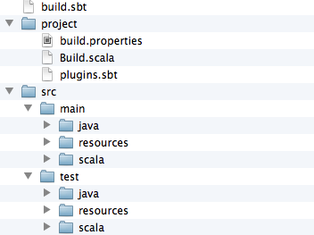
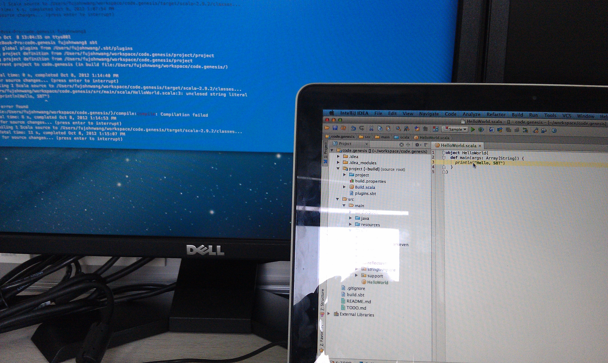

# 使用SBT构建Scala应用

## SBT简介

SBT是Simple Build Tool的简称，如果读者使用过Maven，那么可以简单将SBT看做是Scala世界的Maven，虽然二者各有优劣，但完成的工作基本是类似的。

虽然Maven同样可以管理Scala项目的依赖并进行构建， 但SBT的某些特性却让人如此着迷，比如：

* 使用Scala作为DSL来定义build文件（one language rules them all）;
* 通过触发执行(trigger execution)特性支持持续的编译与测试；
* 增量编译；^[SBT的增量编译支持因为如此优秀，已经剥离为Zinc，可被Eclipse, Maven,Gradle等使用]
* 可以混合构建Java和Scala项目；
* 并行的任务执行；
* 可以重用Maven或者ivy的repository进行依赖管理；

等等这些，都是SBT得以在Scala的世界里广受欢迎的印记。

SBT的发展可以分为两个阶段， 即SBT_0.7.x时代以及SBT_0.10.x以后的时代。

目前来讲， SBT_0.7.x已经很少使用， 大部分公司和项目都已经迁移到0.10.x以后的版本上来，最新的是0.12版本。 0.10.x之后的版本build定义采用了新的Settings系统，与最初0.7.x版本采用纯Scala代码来定义build文件大相径庭，虽然笔者在迁移之前很抵触（因为0.7.x中采用Scala定义build文件的做法可以体现很好的统一性），但还是升级并接纳了0.10.x以后的版本，并且也逐渐意识到， 虽然新的版本初看起来很复杂，但一旦了解了其设计和实现的哲学跟思路，就会明白这种设计可以更便捷的定义build文件。而且可选的build文件方式也同样运行采用Scala代码来定义，即并未放弃统一性的思想。

以上是SBT的简单介绍，如果读者已经急于开始我们的SBT之旅，那么让我们先从SBT的安装和配置开始吧！

## SBT安装和配置

SBT的安装和配置可以采用两种方式，一种是所有平台都通用的安装配置方式，另一种是跟平台相关的安装和配置方式，下面我们分别对两种方式进行详细介绍。

### 所有平台通用的安装配置方式
所有平台通用的安装和配置方式只需要两步：

1. 下载sbt boot launcher
	- 本书采用最新的sbt0.12，其下载地址为<http://typesafe.artifactoryonline.com/typesafe/ivy-releases/org.scala-sbt/sbt-launch/0.12.0/sbt-launch.jar>；  
2. 创建sbt启动脚本（启动脚本是平台相关的）
	- 如果是Linux/Unit系统，创建名称为sbt的脚本，并赋予其执行权限，并将其加到PATH路径中； sbt脚本内容类似于
``java -Xms512M -Xmx1536M -Xss1M -XX:+CMSClassUnloadingEnabled -XX:MaxPermSize=384M -jar `dirname $0`/sbt-launch.jar "$@"``， 可以根据情况调整合适的java进程启动参数；
	- 如果是Windows系统，则创建sbt.bat命令行脚本，同样将其添加到PATH路径中。 脚本内容类似于``set SCRIPT_DIR=%~dp0 \n
java -Xmx512M -jar "%SCRIPT_DIR%sbt-launch.jar" %*``

以上两步即可完成sbt的安装和配置。

### 平台相关的安装配置方式
笔者使用的是Mac系统，安装sbt只需要执行``brew install sbt``即可（因为我已经安装有homebrew这个包管理器），使用macport同样可以很简单的安装sbt - ``sudo port install sbt``;

如果读者使用的是Linux系统，那么这些系统通常都会有相应的包管理器可用，比如yum或者apt，安装和配置sbt也同样轻松，只要简单的运行``yum install sbt`` 或者 ``apt-get install sbt``命令就能搞定(当然，通常需要先将有sbt的repository添加到包管理器的列表中)；

Windows的用户也可以偷懒，只要下载MSI文件直接安装，MSI文件下载地址为<http://scalasbt.artifactoryonline.com/scalasbt/sbt-native-packages/org/scala-sbt/sbt/0.12.0/sbt.msi>。

以上方式基本上囊括三大主流操作系统特定的安装和配置方式，其它特殊情况读者可以酌情处理 ^_^

## SBT基础篇

既然我们已经安装和配置好了SBT，那就让我们先尝试构建一个简单的Scala项目吧！

### Hello, SBT

在SBT的眼里， 一个最简单的Scala项目可以极简到项目目录下只有一个.scala文件，比如HelloWorld.scala:

```scala
object HelloWorld{
  def main(args: Array[String]) {
    println("Hello, SBT")
  }
}
```

假设我们HelloWorld.scala放到hello目录下，那么可以尝试在该目录下执行：
<pre>
$ sbt   
> run  
[info] Running HelloWorld   
Hello, SBT   
[success] Total time: 2 s, completed Sep 2, 2012 7:54:58 PM
</pre>
怎么样，是不是很简单那？ （画外音： 这岂止是简单，简直就是个玩具嘛，有啥用嘛？！ 来点儿实在的行不？）

好吧， 笔者也承认这太小儿科了，所以，我们还是来点儿"干货"吧！

> NOTE: 以上实例简单归简单，但可不要小看它哦，你可知道笔者开始就因为忽略了如此简单的小细节而"光阴虚度"？ 该实例的项目目录下，没有定义任何的build文件，却依然可以正确的执行sbt命令， 实际上， 即使在一个空目录下执行sbt命令也是可以成功进入sbt的console的。 所以，只要了解了sbt构建的这个最低条件，那么，当你无意间在非项目的根目录下执行了相应sbt命令而出错的时候，除了检查build文件的定义，另外要注意的就是，你是否在预想的项目根目录下面执行的sbt命令！

### SBT项目工程结构详解

一般意义上讲，SBT工程项目的目录结构跟Maven的很像， 如果读者接触过Maven，那么可以很容易的理解如下内容。

一个典型的SBT项目工程结构如下图所示：



#### src目录详解

Maven用户对src目录的结构应该不会感到陌生，下面简单介绍各个子目录的作用。

* src/main/java目录存放Java源代码文件
* src/main/resources目录存放相应的资源文件
* src/main/scala目录存放Scala源代码文件
* src/test/java目录存放Java语言书写的测试代码文件
* src/test/resources目录存放测试起见使用到的资源文件
* src/test/scala目录存放scala语言书写的测试代码文件

#### build.sbt详解

读者可以简单的将build.sbt文件理解为Maven项目的pom.xml文件，它是build定义文件。 SBT运行使用两种形式的build定义文件，一种就是放在项目的根目录下，即build.sbt， 是一种简化形式的build定义； 另一种放在project目录下，采用纯Scala语言编写，形式更加复杂，当然，也更完备，更有表现力。

我们暂时先介绍build.sbt的定义格式，基于scala的build定义格式我们稍后再细说。

一个简单的build.sbt文件内容如下：

```scala
name := "hello"      // 项目名称

organization := "xxx.xxx.xxx"  // 组织名称

version := "0.0.1-SNAPSHOT"  // 版本号

scalaVersion := "2.9.2"   // 使用的Scala版本号


// 其它build定义
```

其中， name和version的定义是必须的，因为如果想生成jar包的话，这两个属性的值将作为jar包名称的一部分。 

build.sbt的内容其实很好理解，可以简单理解为一行代表一个键值对(Key-Value Pair)，各行之间以空行相分割。

当然，实际情况要比这复杂，需要理解SBT的Settings引擎才可以完全领会， 以上原则只是为了便于读者理解build.sbt的内容。

除了定义以上项目相关信息，我们还可以在build.sbt中添加项目依赖：

```scala
// 添加源代码编译或者运行期间使用的依赖
libraryDependencies += "ch.qos.logback" % "logback-core" % "1.0.0"

libraryDependencies += "ch.qos.logback" % "logback-classic" % "1.0.0"

// 或者

libraryDependencies ++= Seq(
                            "ch.qos.logback" % "logback-core" % "1.0.0",
                            "ch.qos.logback" % "logback-classic" % "1.0.0",
                            ...
                            )

// 添加测试代码编译或者运行期间使用的依赖
libraryDependencies ++= Seq("org.scalatest" %% "scalatest" % "1.8" % "test") 
```

甚至于直接使用ivy的xml定义格式:

```scala
ivyXML :=
  <dependencies>
    <dependency org="org.eclipse.jetty.orbit" name="javax.servlet" rev="3.0.0.v201112011016">
        <artifact name="javax.servlet" type="orbit" ext="jar"/>
    </dependency>
    <exclude module="junit"/>
    <exclude module="activation"/>
    <exclude module="jmxri"/>
    <exclude module="jmxtools"/>
    <exclude module="jms"/>
    <exclude module="mail"/>
  </dependencies>
```

在这里，我们排除了某些不必要的依赖，并且声明了某个定制过的依赖声明。

当然， build.sbt文件中还可以定义很多东西，比如添加插件，声明额外的repository，声明各种编译参数等等，我们这里就不在一一赘述了。

#### project目录即相关文件介绍

project目录下的几个文件实际上都是非必须存在的，可以根据情况添加。

__build.properties__文件声明使用的要使用哪个版本的SBT来编译当前项目， 最新的sbt boot launcher可以能够兼容编译所有0.10.x版本的SBT构建项目，比如如果我使用的是0.12版本的sbt，但却想用0.11.3版本的sbt来编译当前项目，则可以在build.properties文件中添加`sbt.version=0.11.3`来指定。 默认情况下，当前项目的构建采用使用的sbt boot launcher对应的版本。

__plugins.sbt__文件用来声明当前项目希望使用哪些插件来增强当前项目使用的sbt的功能，比如像assembly功能，清理ivy local cache功能，都有相应的sbt插件供使用， 要使用这些插件只需要在plugins.sbt中声明即可，不用自己去再造轮子：

```scala
resolvers += Resolver.url("git://github.com/jrudolph/sbt-dependency-graph.git")

resolvers += "sbt-idea-repo" at "http://mpeltonen.github.com/maven/"

addSbtPlugin("com.github.mpeltonen" % "sbt-idea" % "1.1.0")

addSbtPlugin("net.virtual-void" % "sbt-dependency-graph" % "0.6.0")
```

在笔者的项目中， 使用sbt-idea来生成IDEA IDE对应的meta目录和文件，以便能够使用IDEA来编写项目代码； 使用sbt-dependency-graph来发现项目使用的各个依赖之间的关系；

为了能够成功加载这些sbt插件，我们将他们的查找位置添加到resolovers当中。有关resolvers的内容，我们后面将会详细介绍，这里注意一个比较有趣的地方就是，sbt支持直接将相应的github项目作为依赖或者插件依赖，而不用非得先将相应的依赖或者插件发布到maven或者ivy的repository当中才可以使用。

#### 其它

以上目录和文件通常是在创建项目的时候需要我们创建的，实际上， SBT还会在编译或者运行期间自动生成某些相应的目录和文件，比如SBT会在项目的根目录下和project目录下自动生成相应的target目录，并将编译结果或者某些缓存的信息置于其中， 一般情况下，我们不希望将这些目录和文件记录到版本控制系统中，所以，通常会将这些目录和文件排除在版本管理之外。 

比如， 如果我们使用git来做版本控制，那么就可以在.gitignore中添加一行`"target/"`来排除项目根目录下和project目录下的target目录及其相关文件。


> TIPS
> 
> 在sbt0.7.x时代， 我们只要创建项目目录，然后在项目目录下敲入sbt，则应该创建哪些需要的目录和文件就会由sbt自动为我们生成， 而sbt0.10之后，这项福利就没有了。 所以，刚开始，我们可能会认为要很苦逼的执行一长串命令来生成相应的目录和文件：
> <pre>
	$ touch build.sbt
	$ mkdir src
	$ mkdir src/main
	$ mkdir src/main/java
	$ mkdir src/main/resources
	$ mkdir src/main/scala
	$ mkdir src/test
	$ mkdir src/test/java
	$ mkdir src/test/resources
	$ mkdir src/test/scala
	$ mkdir project
	$ ...
</pre>
> 如果是Maven的用户，是不是很想念Maven的Archetype特性那？！ 
> 其实， SBT为我们关了一扇窗，却开了另一道门， 我们可以使用giter8来自动化以上步骤。
> giter8可以自动从github上抓取.g8项目模板，并自动在本地生成相应的项目结构， 比如笔者在github上创建了xsbt.g8项目模板，则直接执行`"g8 fujohnwang/xsbt"`就可以在本地自动生成一个sbt的项目。 有关giter8的更多信息可参考<https://github.com//giter8>.


### SBT的使用
SBT支持两种使用方式：

1. 批处理模式(batch mode)
2. 可交互模式(interactive mode)

批处理模式是指我们可以在命令行模式下直接依次执行多个SBT命令， 比如:

```
$ sbt compile test package
```

而可交互模式则直接运行sbt，后面不跟任何SBT命令，在这种情况下， 我们将直接进入sbt控制台(console)， 在sbt控制台中，我们可以输入任何合法的sbt命令并获得相应的反馈：

```
$ sbt
> compile
[success] Total time: 1 s, completed Sep 3, 2012 9:34:58 PM
> test
[info] No tests to run for test:test
[success] Total time: 0 s, completed Sep 3, 2012 9:35:04 PM
> package
[info] Packaging XXX_XXX_2.9.2-0.1-SNAPSHOT.jar ...
[info] Done packaging.
[success] Total time: 0 s, completed Sep 3, 2012 9:35:08 PM
``` 

> TIPS
> 
> 在可交互模式的sbt控制台下，可以输入help获取进一步的使用信息。

在以上实例中，我们依次执行了compile， test和package命令， 实际上， 这些命令之间是有依赖关系的，如果仅仅是为了package，那么，只需要执行package命令即可， package命令依赖的compile和test命令将先于package命令执行，以保证它们之间的依赖关系得以满足。

除了compile，test和package命令， 下面列出了更多可用的sbt命令供读者参考:

* compile
* test-compile
* run
* test
* package

这些命令在某些情况下也可以结合SBT的触发执行(Trigger Execution)机制一起使用， 唯一需要做的就只是在相应的命令前追加`~ `符号，实际上，这个特性是让笔者最着迷的， 比如:

```
$ sbt ~compile
```

以上命令意味着， 我更改了任何源代码并且保存之后，将直接触发SBT编译相应的源代码以及相应的依赖变更。 假如我们有2个显示器， 左边是命令行窗口，右边是编辑器或者IDE窗口，那么，我们只要在右边的显示器中编辑源代码，左边的显示器就可以实时的反馈编译结果， 这将极大加快开发的迭代速度， 听起来并且看起来是不是很cool？！


> NOTE
>
> 原则上， `~`和相应命令之间应该用空格分隔，不过对于一般的命令来讲，直接前缀`~`也是可以的，就跟我们使用`~compile`的方式一样。


### SBT的依赖管理

在SBT中， 类库的依赖管理可以分为两类：

1. unmanaged dependencies
2. managed dependencies

大部分情况下，我们会采用managed dependencies方式来管理依赖关系，但也不排除为了快速构建项目环境等特殊情况下，直接使用unmanaged dependencies来管理依赖关系。

#### Unmanaged Dependencies简介

要使用unmanaged dependencies的方式来管理依赖其实很简单，只需要将想要放入当前项目classpath的jar包放到__lib__目录下即可。

如果对默认的lib目录看着不爽， 我们也可以通过配置来更改这个默认位置，比如使用3rdlibs:

```scala
unmanagedBase <<= baseDirectory { base => base / "3rdlibs" }
```

这里可能需要解释一下以上配置。 首先unmanagedBase这个Key用来表示unmanaged dependencies存放第三方jar包的路径， 具体的值默认是__lib__， 我们为了改变这个Key的值， 采用<<=操作符， 根据baseDirectory的值转换并计算出一个新值赋值给unmanagedBase这个Key， 其中， baseDirectory指的是当前项目目录，而<<=操作符(其实是Key的方法)则负责从已知的某些Key的值计算出新的值并赋值给指定的Key。

关于Unmanaged dependencies，一般情况下，需要知道的基本上就这些。

#### Managed Dependencies详解

sbt的managed dependencies采用Apache Ivy的依赖管理方式， 可以支持从Maven或者Ivy的Repository中自动下载相应的依赖。

简单来说，在SBT中， 使用managed dependencies基本上就意味着往__libraryDependencies__这个Key中添加所需要的依赖， 添加的一般格式如下:

> libraryDependencies += groupID % artifactID % revision

比如： 

> libraryDependencies += "org.apache.derby" % "derby" % "10.4.1.3"

这种格式其实是简化的常见形式，实际上，我们还可以做更多微调， 比如：

```scala
(1) libraryDependencies += "org.apache.derby" % "derby" % "10.4.1.3" % "test"
(2) libraryDependencies += "org.apache.derby" % "derby" % "10.4.1.3" exclude("org", "artifact")
(3) libraryDependencies += "org.apache.derby" %% "derby" % "10.4.1.3" 
```

(1)的形式允许我们限定依赖的范围只限于测试期间； (2)的形势允许我们排除递归依赖中某些我们需要排除的依赖； (3)的形式则会在依赖查找的时候，将当前项目使用的scala版本号追加到artifactId之后作为完整的artifactId来查找依赖，比如如果我们的项目使用scala2.9.2，那么(3)的依赖声明实际上等同于`"org.apache.derby" %% "derby_2.9.2" % "10.4.1.3"`，这种方式更多是为了简化同一依赖类库存在有多个Scala版本对应的发布的情况。

如果有一堆依赖要添加，一行一行的添加是一种方式，其实也可以一次添加多个依赖：

```scala
libraryDependencies ++= Seq("org.apache.derby" %% "derby" % "10.4.1.3",
                            "org.scala-tools" %% "scala-stm" % "0.3", 
                            ...)
```

#### Resovers简介

对于managed dependencies来说，虽然我们指定了依赖哪些类库，但有没有想过，SBT是如何知道到哪里去抓取这些类库和相关资料那？！

实际上，默认情况下， SBT回去默认的Maven2的Repository中抓取依赖，但如果默认的Repository中找不到我们的依赖，那我们可以通过resolver机制，追加更多的repository让SBT去查找并抓取， 比如：

> resolvers += "Sonatype OSS Snapshots" at "https://oss.sonatype.org/content/repositories/snapshots"

at^[at实际上是String类型进行了隐式类型转换(Implicit conversion)后目标类型的方法名]之前是要追加的repository的标志名称（任意取），at后面则是要追加的repository的路径。

除了可远程访问的Maven Repo，我们也可以将本地的Maven Repo追加到resolver的搜索范围：

> resolvers += "Local Maven Repository" at "file://"+Path.userHome.absolutePath+"/.m2/repository" 


## SBT进阶篇

### .scala形式的build定义
对于简单的项目来讲，.sbt形式的build定义文件就可以满足需要了，但如果我们想要使用SBT的一些高级特性，比如自定义Task， 多模块的项目构建， 就必须使用.scala形式的build定义了。 简单来讲，.sbt能干的事情，.scala形式的build定义都能干，反之，则不然。

要使用.scala形式的build定义，只要在当前项目根目录下的project/子目录下新建一个.scala后缀名的scala源代码文件即可，比如Build.scala（名称可以任意，一般使用Build.scala）：

```scala
import sbt._
import Keys._

object HelloBuild extends Build {
	override lazy val settings = super.settings ++ Seq(..)
	
	lazy val root = Project(id = "hello",
                            base = file("."),
                            settings = Project.defaultSettings ++ Seq(..))
}
```

build的定义只要扩展sbt.Build，然后添加相应的逻辑即可，所有代码都是标准的scala代码，在Build定义中，我们可以添加更多的settings， 添加自定义的task，添加相应的val和方法定义等等， 更多代码实例可以参考SBT Wiki(<https://github.com/harrah/xsbt/wiki/Examples>)，另外，我们在后面介绍SBT的更多高级特性的时候，也会引入更多.scala形式的build定义的使用。

	NOTE
	
	.sbt和.scala之间不得不说的那些事儿
	
	实际上， 两种形式并不排斥，并不是说我使用了前者，就不能使用后者，对于某些单一的项目来说，我们可以在.sbt中定义常用的settings，而在.scala中定义自定义的其它内容， SBT在编译期间，会将.sbt中的settings等定义与.scala中的定义合并，作为最终的build定义使用。
	
	只有在多模块项目构建中，为了避免多个.sbt的存在引入过多的繁琐，才会只用.scala形式的build定义。
	
	.sbt和.scala二者之间的settings是可互相访问的， .scala中的内容会被import到.sbt中，而.sbt中的settings也会被添加到.scala的settings当中。默认情况下，.sbt中的settings会被纳入Project级别的Scope中，除非明确指定哪些Settings定义的Scope； .scala中则可以将settings纳入Build级别的Scope，也可以纳入Project级别的Scope。

#### SBT项目结构的本质

在了解了.sbt和.scala两种形式的build定义形式之后， 我们就可以来看看SBT项目构建结构的本质了。

首先， 一个SBT项目，与构建相关联的基本设施可以概况为3个部分， 即：

1. 项目的根目录， 比如hello/， 用来界定项目构建的边界；
2. 项目根目录下的*.sbt文件， 比如hello/build.sbt， 用来指定一般性的build定义；
3. 项目根目录下的project/*.scala文件， 比如hello/project/Build.scala， 用来指定一些复杂的， *.sbt形式的build定义文件不太好搞的设置；

也就是说， 对于一个SBT项目来说，SBT在构建的时候，只关心两点：

1. build文件的类型（是\*.sbt还是*.scala）；
2. build文件的存放位置（\*.sbt文件只有存放在项目的根目录下， SBT才会关注它或者它们， 而\*.scala文件只有存放在项目根目录下的project目录下，SBT才不会无视它或者它们）^[实际上，只有那些定义了扩展自sbt.Build类的scala文件，才会被认为是build定义]；

在以上基础规则的约束下，我们来引入一个推导条件， 即：

	项目的根目录下的project/目录，其本身也是一个标准的SBT项目。

在这个条件下，我们再来仔细分析hello/project/目录，看它目录下的各项artifacts到底本质上应该是什么。

我们说项目根目录下的project/子目录下的*.scala文件是当前项目的build定义文件， 而根据以上的推导条件， project/目录本身又是一个SBT项目，我们还知道，SBT下面下的\*.scala都是当前项目的源代码，所以project/下的\*.scala文件， 其实都是project这个目录下的SBT项目的源代码，而这些源代码中，如果有人定义了sbt.Build，那么就会被用作project目录上层目录界定的SBT项目的build定义文件， right？！

那么，来想一个问题，如果project/目录下的*.scala是源代码文件，而project目录整体又是一个标准的SBT项目， 假如我们这些\*.scala源码文件中需要依赖其他三方库，通常我们会怎么做？ 

对， 在当前项目的根目录下新建一个build.sbt文件，将依赖添加进去，所以，我们就有了如下的项目结构：

```
hello/
	*.scala
	build.sbt
	project/
		*.scala
		build.sbt
```

也就是说，我们可以在书写当前项目的build定义的时候(因为build定义也是用scala来写)，借用第三方依赖来完成某些工作，而不用什么都重新去写，在project/build.sbt下添加项目依赖，那么就可以在project/*.scala里面使用，进而构建出hello/项目的build定义是什么， 即hello/project/这个SBT项目，支撑了上一层hello/这个项目的构建！

现在再来想一下，如果hello/project/这个项目的构建要用到其它SBT特性，比如自定义task或者command啥的，我们该怎么办？！

既然hello/project/也是一个SBT项目，那么按照惯例，我们就可以再其下再新建一个project/目录，在这个下一层的project/目录下再添加\*.scala源文件作为hello/project/这个SBT项目的build定义文件， 整个项目又变成了：


```
hello/
	*.scala
	build.sbt
	project/
		*.scala
		build.sbt
		/project
			*.scala
```

而如果hello/project/project/下的源码又要依赖其他三方库那？！ God， 再添加*.sbt或更深一层的project/\*.scala！ 

也就是说， 从第一层的项目根目录开始， 其下project/目录内部再嵌套project/目录，可以无限递归，而且每一层的project/目录都界定了一个SBT项目，而每一个下层的project目录界定的SBT项目其实都是对上一层的SBT项目做支持，作为上一层SBT项目的build定义项目，这就跟俄罗斯娃娃这种玩具似的， 递归嵌套，一层又包一层：


一般情况下，我们不会搞这么多嵌套，但理解了SBT项目的这个结构上的本质，可以帮助我们更好的理解后面的内容，如果读者看一遍没能理解，那不妨多看几次，多参考其他资料，多揣摩揣摩吧！

### 	自定义SBT Task

大部分情况下，我们都是使用SBT内建的Task，比如compile， run等，实际上， 除了这些，我们还可以在build定义中添加更多自定义的Task。

自定义SBT的Task其实很简单，就跟把大象关冰箱里一样简单， 概况来说其实就是:

1. 定义task；
2. 将task添加到项目的settings当中；
3. 使用自定义的task；

#### 定义task

Task的定义分两部分，第一部分就是要定义一个TaskKey来标志Task， 第二部分则是定义Task的执行逻辑。 

假设我们要定义一个简单的打印"hello, sbt~"信息的task，那第一步就是先定义它的Key，如下代码所示：

```scala
val hello = TaskKey[Unit]("hello", "just say hello")
```

TaskKey的类型指定了对应task的执行结果，因为我们只想打印一个字符串，不需要返回什么数据，所以定义的是TaskKey[Unit]。 定义TaskKey最主要的一点就是要指定一个名称（比如第一个参数“hello”），这个名称将是我们调用该task的标志性建筑。 另外，还可以可选择的通过第二个参数传入该task的相应描述和说明。

有了task对应的Key之后，我们就要定义task对应的执行逻辑，并通过`:=`方法将相应的key和执行逻辑定义关联到一起：

```scala
hello := {
	println("hello, sbt~")
}
```

完整的task定义代码如下所示：

```scala
val hello = TaskKey[Unit]("hello", "just say hello")

hello := {
	println("hello, sbt~")
}
```

	NOTE
	
	:= 只是简单的将task的执行逻辑和key关联到一起， 如果之前已经将某一执行逻辑跟同一key关联过，则后者将覆盖前者，另外，如果我们想要服用其他的task的执行逻辑，或者依赖其他task，只有一个:=就有些力不从心了。这些情况下，可以考虑使用~=或者<<=等方法，他们可以借助之前的task来映射或者转换新的task定义。比如（摘自sbt wiki）:
	// These two settings are equivalent
	intTask <<= intTask map { (value: Int) => value + 1 }
	intTask ~= { (value: Int) => value + 1 }

#### 将task添加到项目的settings当中

光完成了task的Key和执行逻辑定义还不够，我们要将这个task添加到项目的Settings当中才能使用它，所以，我们稍微对之前的代码做一补充：

```scala
object ProjectBuild extends Build {

  val hello = TaskKey[Unit]("hello", "just say hello")

  val helloTaskSetting = hello := {
    println("hello, sbt~")
  }

  lazy val root = Project(id = "", base = file(".")).settings(Defaults.defaultSettings ++ Seq(helloTaskSetting): _*)

}
```

将Key与task的执行逻辑相关联的过程实际上是构建某个Setting的过程，虽然我们也可以将以上定义写成如下形式:

```scala
  lazy val root = Project(id = "", base = file(".")).settings(Defaults.defaultSettings ++ Seq(hello := {
    println("hello, sbt~")
  }): _*)
```

但未免代码就太不雅观，也不好管理了(如果要添加多个自定义task，想想，用这种形式是不是会让代码丑陋不堪那？！)，所以，我们引入了helloTaskSetting这个标志常量来帮助我们净化代码结构 ：）

#### 测试和运行定义的task

万事俱备之后，就可以使用我们的自定义task了，使用定义Key的时候指定的task名称来调用它即可：
	
	$ sbt hello
	hello, sbt~
	// 或者
	$ sbt
	> hello
	hello, sbt~
	[success] Total time: 0 s, completed Oct 4, 2012 2:48:48 PM
	
怎么样？ 在SBT中自定义task是不是很简单那？！

### 	SBT Plugins

每个项目最终都要以相应的形式发布^[这里的发布更多是指特殊的发布形式，比如提供完整的下载包给用户，直接打包成部署包等。一般情况下，如果用Maven或者SBT，可以直接publish到相应的Maven或者Ivy Repository中]，比如二进制包， 源码包，甚至直接可用的部署包等等， 假设我们想把当前的SBT项目打包成可直接解压部署的形式，我们可以使用刚刚介绍的自定义task来完成这一工作:

```scala
object ProjectBuild extends Build {

  import Tasks._

  lazy val root = Project(id = "", base = file(".")).settings(Defaults.defaultSettings ++ Seq(distTask, helloTaskSetting): _*)

}

object Tasks {

  val hello = TaskKey[Unit]("hello", "just say hello")

  val helloTaskSetting = hello := {
    println("hello, sbt~")
  }
  
  val dist = TaskKey[Unit]("dist", "distribute current project as zip or gz packages")

  val distTask = dist <<= (baseDirectory, target, fullClasspath in Compile, packageBin in Compile, resources in Compile, streams) map {
    (baseDir, targetDir, cp, jar, res, s) =>
      s.log.info("[dist] prepare distribution folders...")
      val assemblyDir = targetDir / "dist"
      val confDir = assemblyDir / "conf"
      val libDir = assemblyDir / "lib"
      val binDir = assemblyDir / "bin"
      Array(assemblyDir, confDir, libDir, binDir).foreach(IO.createDirectory)

      s.log.info("[dist] copy jar artifact to lib...")
      IO.copyFile(jar, libDir / jar.name)

      s.log.info("[dist] copy 3rd party dependencies to lib...")
      cp.files.foreach(f => if (f.isFile) IO.copyFile(f, libDir / f.name))

      s.log.info("[dist] copy shell scripts to bin...")
      ((baseDir / "bin") ** "*.sh").get.foreach(f => IO.copyFile(f, binDir / f.name))

      s.log.info("[dist] copy configuration templates to conf...")
      ((baseDir / "conf") * "*.xml").get.foreach(f => IO.copyFile(f, confDir / f.name))

      s.log.info("[dist] copy examples chanenl deployment...")
      IO.copyDirectory(baseDir / "examples", assemblyDir / "examples")

      res.filter(_.name.startsWith("logback")).foreach(f => IO.copyFile(f, assemblyDir / f.name))
  }
}
```

这种方式好是好，可就是不够通用，你我应该都不想每个项目里的Build文件里都拷贝粘帖一把这些代码吧？！ 况且， 哪些artifacts要打包进去，打包之前哪些参数可以调整，以这种形式来看，都不方便调整(如果你不烦每次都添加修改代码的话)， 那SBT有没有更好的方式来支持类似的需求那？！ 当然有咯， SBT的Plugins机制就是为此而生的！

#### SBT Plugin简介

SBT Plugin机制允许我们扩展SBT项目的build定义， 这里的扩展基本可以理解为允许我们向项目的build定义里添加各种所需的Settings， 比如自定义Task，瞅一眼Plugin的代码就更明了了：

```scala
trait Plugin {
  def settings: Seq[Setting[_]] = Nil
}
```

我们知道如果项目位于hello目录下的话， 该项目的build定义可以位于`hello/\*.sbt`或者`hello/project/*.scala`两种位置，既然Plugin是对build定义的扩展，那么， 我们就可以认为项目的build定义依赖这些plugin的某些状态或者行为，即plugin属于项目build定义的某种依赖，从这个层次来看，plugin的配置和使用跟library dependency的配置和使用是一样的(具体有稍微的差异)。不过，既然plugin是对build定义的扩展（及被依赖），那么，我们应该在build定义对应的SBT项目的build定义中配置它(听起来是不是有些绕？ 如果读者感觉绕，看不明白的话，不妨回头看看"SBT项目结构的本质"一节的内容)，即`hello/project/\*.sbt`或者`hello/project/project/\*.scala`, 大多数情况下，我们会直接在像`hello/project/plugins.sbt`^[plugins.sbt的名称只是便于识别，实际上，SBT只关注.sbt的后缀，具体名称是不关心的，因为plugins.sbt本质上也是一个SBT项目的build定义文件，除了在其中配置Plugin，我们同样可以添加第三方依赖， 追加其他Setting等，跟一般的.sbt配置文件无异]配置文件中配置和添加Plugin：

```scala
resolvers += Resolver.url("git://github.com/jrudolph/sbt-dependency-graph.git")

resolvers += "sbt-idea-repo" at "http://mpeltonen.github.com/maven/"

addSbtPlugin("com.github.mpeltonen" % "sbt-idea" % "1.1.0")

addSbtPlugin("net.virtual-void" % "sbt-dependency-graph" % "0.6.0")
```

因为Plugin实现一般也都是以三方包的形式发布的，`addSbtPlugin`所做的事情实际上就是根据Plugin发布时使用的artifactId等标志性信息^[在SBT中，使用ModuleID来抽象和标志相应三方库的标志]，将它们转换成Setting添加到当前项目build定义中。

如果Plugin是发布到SBT默认会查找的Maven或者Ivy Repository中，则只需要`addSbtPlugin`就行了， 否则， 需要将Plugin发布到的Repository添加到resolvers以便SBT可以发现并加载成功。

#### 有哪些现成的Plugin可以用吗？

在前面的配置实例中，我们已经看到两个笔者常用的Plugin:

1. [sbt-idea](https://github.com/mpeltonen/sbt-idea)
	- 笔者使用IntelliJ IDEA来开发scala应用， sbt-idea这个插件可以帮助我从SBT的配置中生成IDEA这个IDE对应的classpath，项目信息等元数据， 这样，我只要运行`sbt gen-idea`这一命令之后，就可以在IDEA中直接打开当前的SBT项目了。如果读者使用其他的IDEA，那也可以使用类似的插件，比如[sbteclipse](https://github.com/typesafehub/sbteclipse)或者[sbt-netbeans-plugin](https://github.com/remeniuk/sbt-netbeans-plugin)。
2. [sbt-dependency-graph](https://github.com/jrudolph/sbt-dependency-graph)
	- 项目的依赖越多， 依赖关系就越复杂， 这个插件可以帮助我们理清楚项目各个依赖之间的关系，完成跟Maven的dependency:tree类似的功能
	
除了这些， 读者还可以在SBT的[Plugins List](https://github.com/harrah/xsbt/wiki/sbt-0.10-plugins-list)中找到更多有用的Plugin，比如：

1. [xsbt-web-plugin](https://github.com/siasia/xsbt-web-plugin)
	- 看名字就能猜到是干啥的了
2. [sbt-assembly](https://github.com/sbt/sbt-assembly)
	- 可以将当前项目的二进制包以及依赖的所有第三方库都打包成一个jar包发布，即one-jar， 对于那种直接运行的应用程序很方便
3. [sbt-aether-deploy](https://github.com/arktekk/sbt-aether-deploy)
	- 使用aether来部署当前项目， aethor是Maven中管理Repository的API，现在单独剥离出来更通用了
4. [sbt-dirty-money](https://github.com/sbt/sbt-dirty-money)
	- SBT会将项目的依赖抓取到本地的ivy cache中缓存起来，避免频繁的update对带宽造成的浪费，但有些时候需要对缓存里失效的内容进行清理，使用这个插件可以避免自己手动遍历目录逐一删除相应的artifacts	
关于现成可用的Plugin就介绍这些，更多的好东西还是有待读者自己去发掘吧！

	TIPS
	
	如果某些SBT Plugin个人经常用到，那么，可以将这些Plugin配置为Global plugin， 即在用户的home目录下的".sbt/plugins/"目录下新建一个plugins.sbt文件（名称无所谓，类型有所谓，你懂的哦），然后将这些常用的插件配置进去，之后，在任何的SBT项目下，就都可以使用这些插件了，“配置一次，到处运行”！
	
	不过， 笔者建议， 跟项目相关的SBT Plugin还是应该配置到当前项目中，这样，走版本控制，别人都可统一使用这些Plugin，只有哪些自己常用，而与具体项目绑定关系不是很强的Plugin才配置为global的plugin， 道理跟git和svn处理ignore的做法差异是类似的！

#### 想写个自己的SBT Plugin该咋整？！

编写一个自己的SBT Plugin其实并不复杂，一个SBT Plugin工程跟一般的SBT项目并无质上的差异，唯一的差别就在于我们需要在SBT Plugin项目的build定义中指定一项Setting用来表明当前项目是一个SBT Plugin项目，而不是一个一般的SBT项目，这项Setting即：

```scala
sbtPlugin := true
```

有了这项Setting， SBT在编译和发布当前这个Plugin项目的时候就会做两个事情：

1. 将SBT API加入当前项目的classpath中（这样我们就可以在编写Plugin的时候使用到SBT的API）；
2. 在发布(publish-local, publish)当前项目的时候，SBT会搜寻sbt.Plugin的实现，然后将这些实现添加到sbt/sbt.plugins这个文件中，并将这个文件与当前Plugin项目的其它artifacts一起打包到jar中发布；

Plugin项目发布之后，就可以在其他项目中引用它们，怎么用，前面详细介绍过了，这里不再赘述。

有了编写SBT Plugin理论指导，我们就可以着手实践了， 我们先把hello这个自定义task转换为Plugin实现如下：

```scala
// HelloSBT.scala

import sbt._

object HelloSBT extends Plugin {
  val helloSbt = TaskKey[Unit]("hello-sbt", "just say hello")

  val helloSbtSetting = helloSbt := {
    println("hello, sbt~")
  }
}
```

然后，我们为其配置build定义：

```scala
// ${project.root}/build.sbt

name := "hello_sbt_plugin"

organization := "com.github.fujohnwang"

version := "0.0.1"

sbtPlugin := true

scalaVersion := "2.9.2"

```

编译并发布到本地的ivy库中（测试无误后，可以直接发布到其他共享范围更大的repo中），执行：

```scala
sbt publish-local
```

之后，我们就可以在其他SBT项目的build定义中使用到这个SBT Plugin了，比如我们将其添加到某个SBT项目的${project.root}/project/plugins.sbt（名称不重要，还记得吧？ 注意路径）：

```scala
addSbtPlugin("com.github.fujohnwang" % "hello_sbt_plugin" % "0.0.1")
```

并且将__helloSbtSetting__手动配置到${project.root}/build.sbt中：

```scala
HelloSBT.helloSbtSetting
```

好啦，现在算是万事大吉了，在当前SBT项目直接运行`sbt hello-sbt`试试吧！

理论和实践我们都阐明了，现在该说一下在编写SBT Plugin的时候应该注意的一些事情了。

首先，回头查看HelloSBT的代码实现，读者应该发现，我们将SettingKey的名称和变量名都做了改变，这是因为我们在编写Plugin的时候，要尽量避免命名冲突，所以，通过引入当前Plugin的名称前缀来达到这一目的；

其次，我们没有将helloSbtSetting加入到`Plugin.settings`（这里同样注意添加了前缀的命名方式），这就意味着，我们在使用这一Plugin的时候，要手动将这一Setting加到目标项目的build定义中才能使用到它，原因在于，虽然我们可以override并将helloSbtSetting加入`Plugin.settings`，这样可以让SBT自动加载到当前项目，但一般情况下我们不会这样做，因为在多模块的项目中，这一setting也会自动加载到所有项目上，除非是command类型的Plugin，否则，这种行为是不合适的， 故此，大部分Plugin实现都是提供自己的Setting，并让用户决定是否加载使用；

其实，编写一个SBT Plugin还要注意很多东西，但这里就不一一列举了，大家可以参考[Best Practices](http://www.scala-sbt.org/release/docs/Detailed-Topics/Best-Practices.html)和[Plugins Best Practices](http://www.scala-sbt.org/release/docs/Extending/Plugins-Best-Practices.html)这两份SBT Wiki文档，里面详细说明了编写SBT Plugin的一些最佳实践，不过，作为结束，我补充最基本的一点， 即"不要硬编码Plugin实现的任何配置"! 读者可以尝试将dist自定义task转换成一个SBT Plugin，在转换过程中，不妨为"dist"啦， "conf"啦， "bin"啦这些目标目录设立相应的SettingKey并给予默认值，这样就不会像我们的自定义task里似的，直接硬编码这些目录名称了，而且，插件的使用者也可以在使用插件的项目中通过override相应的Plugin的这些SettingKey标志的Setting来提供自定义的值， 怎么样? 动手尝试一把？！

	NOTE
	
	要编写一个SBT Plugin还需要修炼一下SBT的内功，包括搞清楚SBT的Setting系统，Configuration，Command等深层次概念， 这样，在编写SBT Plugin的时候才不会感觉“局促”，^_^

### 	多模块工程管理(Multi-Module Project)

对于Maven用户来说， 多模块的工程管理早就不是什么神秘的特性了吧？！ 但笔者实际上对于这种工程实践却一直持保留意见，因为很多时候，架构项目结构的人并没有很好的理解项目中各种实体的粒度与边界之间的合理关系， 很多明明在package层次/粒度可以搞定的事情也往往被纳入到了子工程的粒度中去，这种不合适的粒度和边界选择，一方面反映了最初规划项目结构的人对自身项目的理解不足，另一方面也会为后继的开发和维护人员带来些许的繁琐。所以很多时候，如果某些关注点足以设立一个项目来管理，那我宁愿直接为其设立独立的项目结构，然后让需要依赖的项目依赖它即可以了（大部分时候，我们要解决的就是各个项目之间的依赖关系，不是吗？），当然， 这种做法并非绝对，只是更多的在强调粒度和边界选择的合理性上。

扯多了，现在让我们来看看在SBT中我们是如何来规划和组织多模块的项目结构的吧！

包含多个子模块或者子项目的SBT项目跟一个标准的独立的SBT项目相差不多，唯一的差别在于：

1. build定义中多了对多个子模块/工程的关系的描述；
2. 项目的根目录下多了多个子模块/工程相应的目录；

下面是一个多模块工程的典型结构：

```
${project.root}
	- build.sbt
	+ src/main/scala
	+ project
		- Build.scala
	+ module1
		- build.sbt
		+ src/main/scala
	+ module2
		- build.sbt
		+ src/main/scala
	+ module3
		- build.sbt
		+ src/main/scala
```

我们可以发现，除了多了各个子模块/工程相应的目录，其它方面跟一个标准独立的SBT项目无异， 这些子模块/工程与当前项目或者其它子模块/工程之间的关系由当前项目的build定义来“说明”， 当然这种关系的描述是如此的“纠缠”，只能在\*.scala形式的build定义中声明， 例如在${project.root}/project/Build.scala)中我们可以简单的定义多个子模块/工程之间的关系如下：

```scala
import sbt._
import Keys._

object MultipleModuleProjectBuild extends Build {
	lazy val root = Project(id = "root",
                            base = file(".")) aggregate(sub1, sub2)
	lazy val sub1 = Project(id = "m1",
                            base = file("module1"))
	lazy val sub2 = Project(id = "m2",
                            base = file("module2")) dependsOn(sub3) 
	lazy val sub3 = Project(id = "m3",
                            base = file("module3")) 
}
```

在当前项目的build定义中，我们声明了多个Project实例来对应相应的子项目，并通过Porject的aggregate和dependsOn来进一步申明各个项目之间的关系。 aggregate指明的是一种并行的相互独立的行为，只是这种行为是随父项目执行相应动作而触发的， 比如，在父项目中执行compile，则会同时触发module1和module2两个子模块的编译，只不过，两个子模块之间的执行顺序等行为并无联系； 而dependsOn则说明一种强依赖关系， 像module2这个子项目，因为它依赖module3，所以，编译module2子模块/项目的话，会首先编译module3，然后才是module2，当然，在module3的相应artifact也会加入到module2的classpath中。

我们既然已经了解了如何在父项目中定义各个子模块/项目之间的关系，下面我们来看一下各个子模块/项目内部的细节吧！ 简单来讲， 每个子模块/项目也可以看作一个标准的SBT项目，但一个很明显的差异在于： __每个子模块/项目下不可以再创建project目录下其下相应的\*.scala定义文件（实际上可以创建，但会被SBT忽略）__。不过， 子模块/项目自己下面还是可以使用.sbt形式的build定义的，在各自的.sbt build定义文件中可以指定各个子模块/项目各自的Setting或者依赖，比如version和LibrarayDependencies等。

一般情况下， SBT下的多模块/工程的组织结构就是如此，即由父项目来规划组织结构和关系，而由各个子模块/项目自治的管理各自的设置和依赖。但这也仅仅是倡导，如果读者愿意，完全可以在父项目的Build定义中添加任何自己想添加的东西，比如将各个子模块/项目的Settings直接挪到父项目的.scala形式的build定义中去（只不过，可能会让这个.scala形式的build定义看起来有些臃肿或者复杂罢了）， 怎么做？ 自己查sbt.Project的scaladoc文档去 ：）

总的来说，多子模块/工程的项目组织主体上还是以父项目为主体，各个子模块/项目虽然有一定的“经济”独立性，但并非完全自治， 貌似跟未成年人在各自家庭里的地位是相似吧？！ 哈～

	TIPS
	
	在Maven的多子模块/项目的组织结构中，我们很喜欢将所有项目可以重用或者共享的一些设定或者依赖放到父项目的build定义中，在SBT中也是可以的，只要在父项目的.sbt或者.scala形式的build定义中添加即可，不过，要将这些共享的设定的scope设定为ThisBuild， 例如：
	
		scalaVersion in ThisBuild := "2.9.2"
	
	这样，就不用在每一个项目/模块的build定义中逐一声明要使用的scala版本了。其它的共享设定可以依法炮制哦～

## SBT扩展篇 - 使用SBT创建可自动补全的命令行应用程序

参看[我的这篇博客](http://fujohnwang.github.com/buld-interactive-command-line-app-with-sbt.html)， 这里不整理重写了， 偷懒ing~


