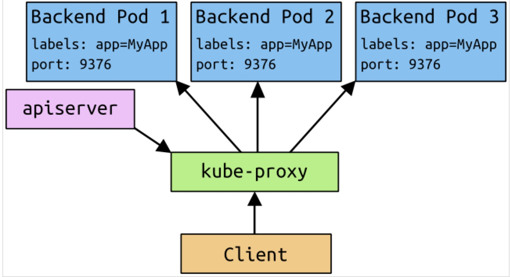

# Kubernetes Services
> Before we don't have dns in kubernetes, service ip can not work properly. So, before you want to make service ip assigned properly, make sure that kube-dns works well in your cluster.(see DNS in Kubernetes.)


## Introduction

Kubernetes Pods are mortal. They are born and they die, and they are not resurrected. ReplicationControllers in particular create and destroy Pods dynamically (e.g. when scaling up or down or when doing rolling updates). While each Pod gets its own IP address, even those IP addresses cannot be relied upon to be stable over time. This leads to a problem: if some set of Pods (let’s call them backends) provides functionality to other Pods (let’s call them frontends) inside the Kubernetes cluster, how do those frontends find out and keep track of which backends are in that set?
Enter Services.

A Kubernetes Service is an abstraction which defines a logical set of Pods and a policy by which to access them - sometimes called a micro-service. The set of Pods targeted by a Service is (usually) determined by a Label Selector (see below for why you might want a Service without a selector).

As an example, consider an image-processing backend which is running with 3 replicas. Those replicas are fungible - frontends do not care which backend they use. While the actual Pods that compose the backend set may change, the frontend clients should not need to be aware of that or keep track of the list of backends themselves. The Service abstraction enables this decoupling.
For Kubernetes-native applications, Kubernetes offers a simple Endpoints API that is updated whenever the set of Pods in a Service changes. For non-native applications, Kubernetes offers a virtual-IP-based bridge to Services which redirects to the backend Pods.

## Example

Let's use nginx to start a test.

```yaml
apiVersion: v1
kind: Service
metadata:
  name: my-nginx-svc
  labels:
    app: nginx
spec:
  type: LoadBalancer
  ports:
  - port: 80
  selector:
    app: nginx
---
apiVersion: extensions/v1beta1
kind: Deployment
metadata:
  name: my-nginx
spec:
  replicas: 2
  template:
    metadata:
      labels:
        app: nginx
    spec:
      containers:
      - name: nginx
        image: 10.126.98.3:5000/nginx:1.0
        ports:
        - containerPort: 80
```

This file create a service object named 'my-nginx-svc' on any Pod with *app=nginx*. This Service will also be assigned an IP address (sometimes called the “cluster IP”), which is used by the service proxies (see below). The Service’s selector will be evaluated continuously and the results will be posted to an Endpoints object also named “my-service”.

Run `kubectl get svc --namespace=kube-system` will see info of 'my-nginx-svc' and `kubectl describe svc $serviceName` will show the detail of your service. Then you can use `curl 10.3.157.211` to check your service works well both in your pods and hosts. 

```shell
$ kubectl get svc my-nginx-svc
NAME           CLUSTER-IP     EXTERNAL-IP   PORT(S)   AGE
my-nginx-svc   10.3.157.211   <pending>     80/TCP    22h

$ kubectl describe svc my-nginx-svc
Name:			my-nginx-svc
Namespace:		default
Labels:			app=nginx
Selector:		app=nginx
Type:			LoadBalancer
IP:			10.3.157.211
Port:			<unset>	80/TCP
NodePort:		<unset>	31581/TCP
Endpoints:		192.168.156.31:80,192.168.34.179:80
Session Affinity:	None
No events.
```
The endpoints mean that the real pods that provide the nginx service. As for *NodePort*, see below.

Note that a Service can map an incoming port to any targetPort. By default the targetPort will be set to the same value as the port field. Perhaps more interesting is that targetPort can be a string, referring to the name of a port in the backend Pods. The actual port number assigned to that name can be different in each backend Pod. This offers a lot of flexibility for deploying and evolving your Services. For example, you can change the port number that pods expose in the next version of your backend software, without breaking clients.

Kubernetes Services support TCP and UDP for protocols. The default is TCP.

There are many others ways to create service(eg : service without selectors), see [kubernetes docs](http://kubernetes.io/docs/user-guide/services/)

## Virtual IPs and service proxies
> After kubernetesv1.3, iptables proxy mode is the default. So, ignore other proxy mode.

#### Proxy-mode: iptables

In this mode, kube-proxy watches the Kubernetes master for the addition and removal of Service and Endpoints objects. For each Service it installs iptables rules which capture traffic to the Service’s clusterIP (which is virtual) and Port and redirects that traffic to one of the Service’s backend sets. For each Endpoints object it installs iptables rules which select a backend Pod.

By default, the choice of backend is random. Client-IP based session affinity can be selected by setting service.spec.sessionAffinity to "ClientIP" (the default is "None").

As with the userspace proxy, the net result is that any traffic bound for the Service’s IP:Port is proxied to an appropriate backend without the clients knowing anything about Kubernetes or Services or Pods. This should be faster and more reliable than the userspace proxy. However, unlike the userspace proxier, the iptables proxier cannot automatically retry another Pod if the one it initially selects does not respond, so it depends on having working readiness probes.



## Discovering services

#### Environment variables
> Use the following command to check.

```shell
$ kubectl exec net-centos2-mrvok -- printenv | grep SERVICE
KUBERNETES_SERVICE_PORT=443
MY_NGINX_SVC_SERVICE_HOST=10.3.157.211
KUBERNETES_SERVICE_PORT_HTTPS=443
MY_NGINX_SVC_SERVICE_PORT=80
KUBERNETES_SERVICE_HOST=10.0.0.1
```

### DNS
> Make sure kube-dns works properly.

An optional (though strongly recommended) cluster add-on is a DNS server. The DNS server watches the Kubernetes API for new Services and creates a set of DNS records for each. If DNS has been enabled throughout the cluster then all Pods should be able to do name resolution of Services automatically.
For example, if you have a Service called "my-service" in Kubernetes Namespace "my-ns" a DNS record for "my-service.my-ns" is created. Pods which exist in the "my-ns" Namespace should be able to find it by simply doing a name lookup for "my-service". Pods which exist in other Namespaces must qualify the name as "my-service.my-ns". The result of these name lookups is the cluster IP.
Kubernetes also supports DNS SRV (service) records for named ports. If the "my-service.my-ns" Service has a port named "http" with protocol TCP, you can do a DNS SRV query for "_http._tcp.my-service.my-ns" to discover the port number for "http".

## Publishing services - service types

For some parts of your application (e.g. frontends) you may want to expose a Service onto an external (outside of your cluster, maybe public internet) IP address, other services should be visible only from inside of the cluster.

Kubernetes ServiceTypes allow you to specify what kind of service you want. The default and base type is ClusterIP, which exposes a service to connection from inside the cluster. NodePort and LoadBalancer are two types that expose services to external traffic.
Valid values for the ServiceType field are:

* ClusterIP: use a cluster-internal IP only - this is the default and is discussed above. Choosing this value means that you want this service to be reachable only from inside of the cluster.
* NodePort: on top of having a cluster-internal IP, expose the service on a port on each node of the cluster (the same port on each node). You’ll be able to contact the service on any <NodeIP>:NodePort address.
* LoadBalancer: on top of having a cluster-internal IP and exposing service on a NodePort also, ask the cloud provider for a load balancer which forwards to the Service exposed as a <NodeIP>:NodePort for each Node.

#### NodePort

If you set the type field to "NodePort", the Kubernetes master will allocate a port from a flag-configured range (default: 30000-32767), and each Node will proxy that port (the same port number on every Node) into your Service. That port will be reported in your Service’s spec.ports[*].nodePort field.

If you want a specific port number, you can specify a value in the nodePort field, and the system will allocate you that port or else the API transaction will fail (i.e. you need to take care about possible port collisions yourself). The value you specify must be in the configured range for node ports.

This gives developers the freedom to set up their own load balancers, to configure cloud environments that are not fully supported by Kubernetes, or even to just expose one or more nodes’ IPs directly.
Note that this Service will be visible as both <NodeIP>:spec.ports[*].nodePort and spec.clusterIp:spec.ports[*].port.

#### LoadBalancer

On cloud providers which support external load balancers, setting the type field to "LoadBalancer" will provision a load balancer for your Service. The actual creation of the load balancer happens asynchronously, and information about the provisioned balancer will be published in the Service’s status.loadBalancer field. For example:

```json
{
    "kind": "Service",
    "apiVersion": "v1",
    "metadata": {
        "name": "my-service"
    },
    "spec": {
        "selector": {
            "app": "MyApp"
        },
        "ports": [
            {
                "protocol": "TCP",
                "port": 80,
                "targetPort": 9376,
                "nodePort": 30061
            }
        ],
        "clusterIP": "10.0.171.239",
        "loadBalancerIP": "78.11.24.19",
        "type": "LoadBalancer"
    },
    "status": {
        "loadBalancer": {
            "ingress": [
                {
                    "ip": "146.148.47.155"
                }
            ]
        }
    }
}
```

Traffic from the external load balancer will be directed at the backend Pods, though exactly how that works depends on the cloud provider. Some cloud providers allow the loadBalancerIP to be specified. In those cases, the load-balancer will be created with the user-specified loadBalancerIP. If the loadBalancerIP field is not specified, an ephemeral IP will be assigned to the loadBalancer. If the loadBalancerIP is specified, but the cloud provider does not support the feature, the field will be ignored.

### External IP

If there are external IPs that route to one or more cluster nodes, Kubernetes services can be exposed on those externalIPs. Traffic that ingresses into the cluster with the external IP (as destination IP), on the service port, will be routed to one of the service endpoints. externalIPs are not managed by Kubernetes and are the responsibility of the cluster administrator.

In the ServiceSpec, externalIPs can be specified along with any of the ServiceTypes. In the example below, my-service can be accessed by clients on 80.11.12.10:80 (externalIP:port)

```json
{
    "kind": "Service",
    "apiVersion": "v1",
    "metadata": {
        "name": "my-service"
    },
    "spec": {
        "selector": {
            "app": "MyApp"
        },
        "ports": [
            {
                "name": "http",
                "protocol": "TCP",
                "port": 80,
                "targetPort": 9376
            }
        ],
        "externalIPs" : [
            "80.11.12.10"
        ]
    }
}
```

## End

There is no ssl in this article. If you want to know more, see the following links.

* [http://kubernetes.io/docs/user-guide/connecting-applications/](http://kubernetes.io/docs/user-guide/connecting-applications/)
* [http://kubernetes.io/docs/user-guide/services/](http://kubernetes.io/docs/user-guide/services/)


