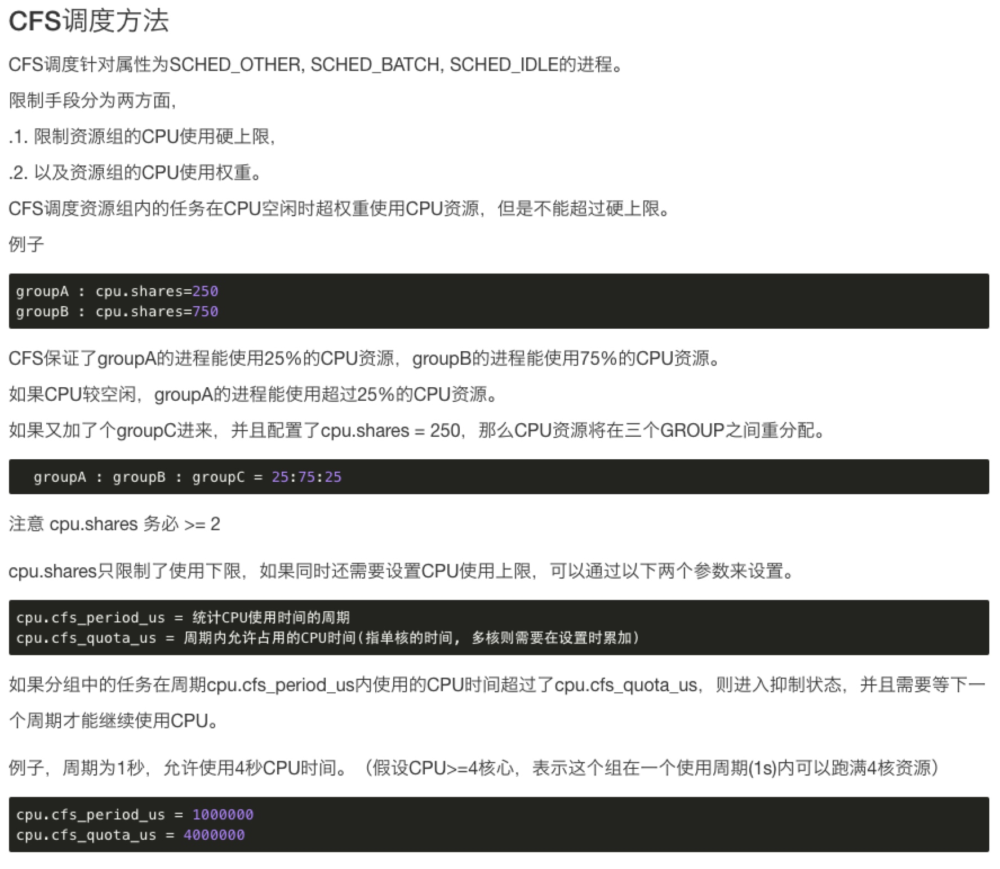
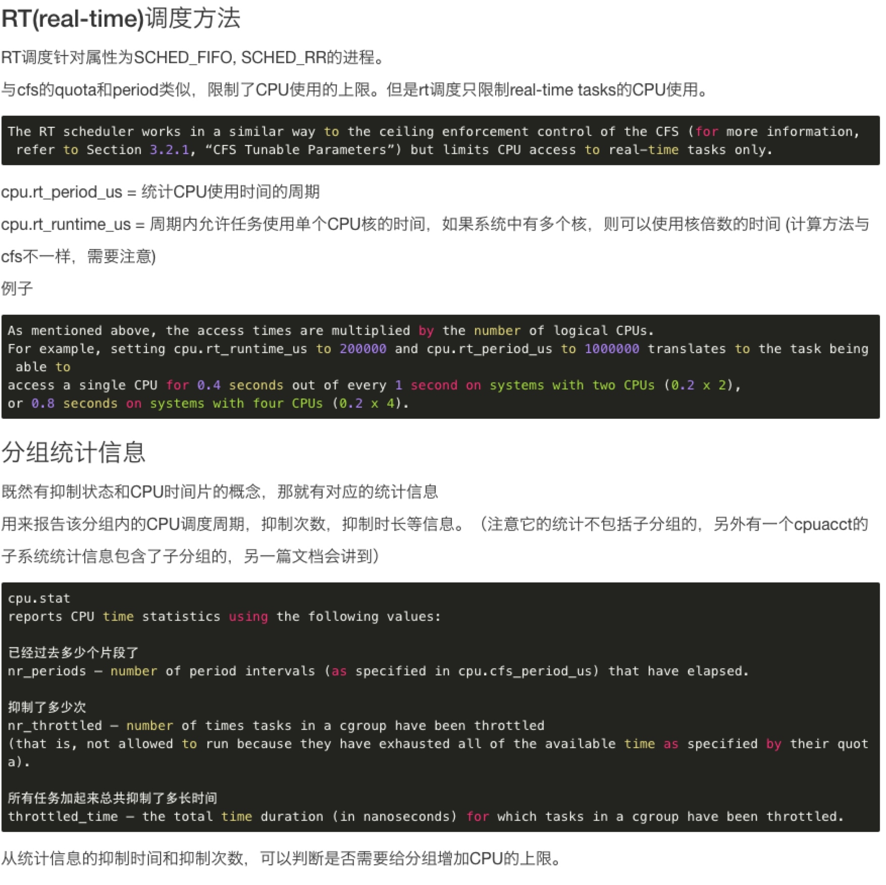

# Cgroup

> this article aim to limit RAM and CPU that one group of users used.

## Install

Control groups and the subsystems to which they relate can be manipulated using shell commands and utilities. However, the easiest way to work with cgroups is to install the libcgroup package. The libcgroup package provides cgroups-related command line utilities, configuration files, and man pages. This package is not installed by default on a CentOS 6 server. To install it, run the following command:
	
```shell
# centos6
$ yum install libcgroup

# centos7
$ yum install libcgroup-tools
```

## Start service

The cgconfig(control group config) service is used to create cgroups and manage subsystems. It can be configured to start up at boot time and reestablish your predefined cgroups, thus making them persistent across reboots. The cgconfig service is not started by default on CentOS 6, so let us start it:

```shell
$ sudo service cgconfig start
```

Starting the cgconfig service creates a virtual filesystem mounted at /cgroup with all the subsystems. Let us verify this:

```shell
# centos6
$ sudo ls /cgroup

# centos7
$ ls /sys/fs/cgroup
```

This command should show the following subsystems: `blkio  cpu  cpuacct  cpuset  devices  freezer  memory  net_cls`

Also, you can use the following command to verify(if docker has been installed on your server, you will see more, because cgroup limitation is the foundation of docker):

```shell
$ lscgroup
cpuset:/
cpu:/
cpuacct:/
memory:/
devices:/
freezer:/
net_cls:/
blkio:/
```

## System Resources

The system resources are known as subsystems, and each subsystem has several parameters to which we could assign values. CentOS 6 provides ten cgroup subsystems:

* blkio — this subsystem sets limits on input/output access to and from block devices such as physical drives (disk, solid state, USB, etc.).
* cpu — this subsystem sets limits on the available CPU time
* cpuacct — this subsystem generates automatic reports on CPU resources used by tasks in a cgroup
* cpuset — this subsystem assigns individual CPUs (on a multicore system) and memory nodes to tasks in a cgroup
* devices — this subsystem allows or denies access to devices by tasks in a cgroup
* freezer — this subsystem suspends or resumes tasks in a cgroup
* memory — this subsystem sets limits on memory use by tasks in a cgroup and generates automatic reports on memory resources used by those tasks
* net_cls — this subsystem tags network packets with a class identifier (classid) that allows the Linux traffic controller (tc) to identify packets originating from a particular cgroup task
* net_prio — this subsystem provides a way to dynamically set the priority of network traffic per network interface
* ns — this is the namespace subsystem

## Configuration

In this section, we will create example cgroups and set some resource limits for those cgroups. The cgroup configuration file is /etc/cgconfig.conf. Depending on the contents of the configuration file, cgconfig can create hierarchies, mount necessary file systems, create cgroups, and set subsystem parameters (resource limits) for each cgroup.

A hierarchy is a set of cgroups arranged in a tree, such that every task in the system is in exactly one of the cgroups in the hierarchy. In a default CentOS 6 configuration, each subsystem is put into its own hierarchy.

Let us first create a few cgroups named limitcpu, limitmem, limitio, and browsers. The /etc/cgconfig.conf file contains two major types of entries — mount and group. Lines that start with group create cgroups and set subsystem parameters. Edit the file /etc/cgconfig.conf and add the following cgroup entries at the bottom:

```shell
group limitcpu{
        cpu {
                cpu.shares = 400;
        }
}

group limitmem{
        memory {
                memory.limit_in_bytes = 134217728;
        }
}

group limitio{
        blkio {
                blkio.throttle.read_bps_device = "252:0         2097152";
        }
}

group browsers{
        cpu {
                cpu.shares = 200;
        }
        memory {
                memory.limit_in_bytes = 134217728;
        }
}
```

* In the limitcpu cgroup, we are limiting the cpu shares available to processes in this cgroup to 400. cpu.shares specifies the relative share of CPU time available to the tasks in the cgroup.
* In the limitmem cgroup, we are limiting memory available to the cgroup processes to 128m.
* In the limitio cgroup, we are limiting the disk read throughput to 2MiB/s. Here we are limiting read I/O to the primary disk, /dev/vda, with major:minor number 252:0 and 2MiB/s is converted to bytes per second (2x1024x1024=2097152).
* In the browsers cgroup, we are limiting cpu shares to 200 and available memory to 128m.

We need to restart the cgconfig service for the changes in the /etc/cgconfig.conf file to take effect:

```shell
$ service cgconfig restart

# verify the cgroups we configured are showing up correctly:
$ lscgroup
cpuset:/
cpu:/
cpu:/browsers
cpu:/limitcpu
cpuacct:/
memory:/
memory:/browsers
memory:/limitmem
devices:/
freezer:/
net_cls:/
blkio:/
blkio:/limitio
```

Our next goal is to add the processes (tasks) for which we wish to limit resources to the cgroups we created earlier.

Cgred (control group rules engine daemon) is a service that moves tasks into cgroups according to parameters set in the /etc/cgrules.conf file. Entries in the /etc/cgrules.conf file can take one of the two forms:

```shell
user subsystems control_group

or

user:command subsystems control_group
```

user refers to a username or a groupname prefixed with the "@" character. subsystems refer to a comma-separated list of subsystem names. control_group represents a path to the cgroup, and command stands for a process name or a full command path of a process. Entries in the /etc/cgrules.conf file can include the following extra notations:

* `@` — indicates a group instead of an individual user. For example, @admin indicates all users in the admin group.
* `*` — represents "all". For example, * in the user field represents all users.
* `%` — represents an item the same as the item in the line above.

Now let us add the programs/processes we wish to limit. Edit /etc/cgrules.conf and add the following at the bottom:

```/etc/cgrules.conf
*:firefox       cpu,memory      browsers/
*:hdparm        blkio   limitio/
sammy   blkio   limitio/
@admin:memhog  memory  limitmem/
*:cpuhog        cpu     limitcpu/
```

In the above lines, we are setting the following rules:

* firefox processes run by any user will be automatically added to the browsers cgroup and limited in cpu and memory subsystems.
* hdparm processes run by any user will be added to the limitio cgroup and will be limited in blkio subsystem according to the parameter values specified in that cgroup.
* All processes run by user sammy will be added to the limitio cgroup and limited in blkio subsystem.
* memhog processes run by anyone in the admin group will be added to the cgroup limitmem and limited in memory subsystem.
* cpuhog processes run by any user will be added to the cgroup limitcpu and limited in cpu subsystem.

Then, we have to restart cgred

```shell
$ service cgred start
```

## Testing

If you want to test if can limit memory, you can use `memtester`, but remember, close swap before running the test.

## Concept

### CPU

#### cpuacct

This subsystem supposed to statistical resource usage.

#### CFS(Completely Fair Scheduler) Tunable Parameters

In CFS, a cgroup can get more than its share of CPU if there are enough idle CPU cycles available in the system, due to the work conserving nature of the scheduler. This is usually the case for cgroups that consume CPU time based on relative shares. Ceiling enforcement can be used for cases when a hard limit on the amount of CPU that a cgroup can utilize is required (that is, tasks cannot use more than a set amount of CPU time).
The following options can be used to configure ceiling enforcement or relative sharing of CPU:

* Ceiling Enforcement Tunable Parameters

	* cpu.cfs_period_us
	
		specifies a period of time in microseconds (µs, represented here as "us") for how regularly a cgroup's access to CPU resources should be reallocated. If tasks in a cgroup should be able to access a single CPU for 0.2 seconds out of every 1 second, set cpu.cfs_quota_us to 200000 and cpu.cfs_period_us to 1000000. The upper limit of the cpu.cfs_quota_us parameter is 1 second and the lower limit is 1000 microseconds.
	
	* cpu.cfs_quota_us
	
		specifies the total amount of time in microseconds (µs, represented here as "us") for which all tasks in a cgroup can run during one period (as defined by cpu.cfs_period_us). As soon as tasks in a cgroup use up all the time specified by the quota, they are throttled for the remainder of the time specified by the period and not allowed to run until the next period. If tasks in a cgroup should be able to access a single CPU for 0.2 seconds out of every 1 second, set cpu.cfs_quota_us to 200000 and cpu.cfs_period_us to 1000000. Note that the quota and period parameters operate on a CPU basis. To allow a process to fully utilize two CPUs, for example, set cpu.cfs_quota_us to 200000 and cpu.cfs_period_us to 100000.
	Setting the value in cpu.cfs_quota_us to -1 indicates that the cgroup does not adhere to any CPU time restrictions. This is also the default value for every cgroup (except the root cgroup).

* Relative Shares Tunable Parameters

	* cpu.shares
	
		contains an integer value that specifies a relative share of CPU time available to the tasks in a cgroup. For example, tasks in two cgroups that have cpu.shares set to 100 will receive equal CPU time, but tasks in a cgroup that has cpu.shares set to 200 receive twice the CPU time of tasks in a cgroup where cpu.shares is set to 100. The value specified in the cpu.shares file must be 2 or higher.
		
		Note that shares of CPU time are distributed per all CPU cores on multi-core systems. Even if a cgroup is limited to less than 100% of CPU on a multi-core system, it may use 100% of each individual CPU core. Consider the following example: if cgroup A is configured to use 25% and cgroup B 75% of the CPU, starting four CPU-intensive processes (one in A and three in B) on a system with four cores results in the following division of CPU shares:

		PID | cgroup | CPU | CPU share
		------------ | ------------- | -------------  | -------------
		100 |	 A	| 0 |	100% of CPU0
		101 |	 B	| 1 |	100% of CPU1
		102 |	 B	| 2 |	100% of CPU2
		103 |	 B	| 3 |	100% of CPU3

		Using relative shares to specify CPU access has two implications on resource management that should be considered:
		
		* Because the CFS does not demand equal usage of CPU, it is hard to predict how much CPU time a cgroup will be allowed to utilize. When tasks in one cgroup are idle and are not using any CPU time, the leftover time is collected in a global pool of unused CPU cycles. Other cgroups are allowed to borrow CPU cycles from this pool.
		* The actual amount of CPU time that is available to a cgroup can vary depending on the number of cgroups that exist on the system. If a cgroup has a relative share of 1000 and two other cgroups have a relative share of 500, the first cgroup receives 50% of all CPU time in cases when processes in all cgroups attempt to use 100% of the CPU. However, if another cgroup is added with a relative share of 1000, the first cgroup is only allowed 33% of the CPU (the rest of the cgroups receive 16.5%, 16.5%, and 33% of CPU).

#### RT Tunable Parameters

The RT scheduler works in a similar way to the ceiling enforcement control of the CFS, but limits CPU access to real-time tasks only. The amount of time for which real-time task can access the CPU is decided by allocating a run time and a period for each cgroup. All tasks in a cgroup are then allowed to access the CPU for the defined period of time for one run time (for example, tasks in a cgroup can be allowed to run 0.1 seconds in every 1 second). Please note that the following parameters take into account all available logical CPUs, therefore the access times specified with these parameters are in fact multiplied by the number of CPUs.

* cpu.rt_period_us
	
	applicable to real-time scheduling tasks only, this parameter specifies a period of time in microseconds (µs, represented here as "us") for how regularly a cgroup's access to CPU resources is reallocated.
	
* cpu.rt_runtime_us

	applicable to real-time scheduling tasks only, this parameter specifies a period of time in microseconds (µs, represented here as "us") for the longest continuous period in which the tasks in a cgroup have access to CPU resources. Establishing this limit prevents tasks in one cgroup from monopolizing CPU time. As mentioned above, the access times are multiplied by the number of logical CPUs. For example, setting cpu.rt_runtime_us to 200000 and cpu.rt_period_us to 1000000 translates to the task being able to access a single CPU for 0.4 seconds out of every 1 second on systems with two CPUs (0.2 x 2), or 0.8 seconds on systems with four CPUs (0.2 x 4).

## Docs

* [https://access.redhat.com/documentation/en-US/Red_Hat_Enterprise_Linux/6/html/Resource_Management_Guide/sec-cpu.html](https://access.redhat.com/documentation/en-US/Red_Hat_Enterprise_Linux/6/html/Resource_Management_Guide/sec-cpu.html)
* [https://yq.aliyun.com/articles/54483](https://yq.aliyun.com/articles/54483)

## Picutres





